## Autor 
# Piero Huaytalla

## Evidencia 1 Verificaar las versiones
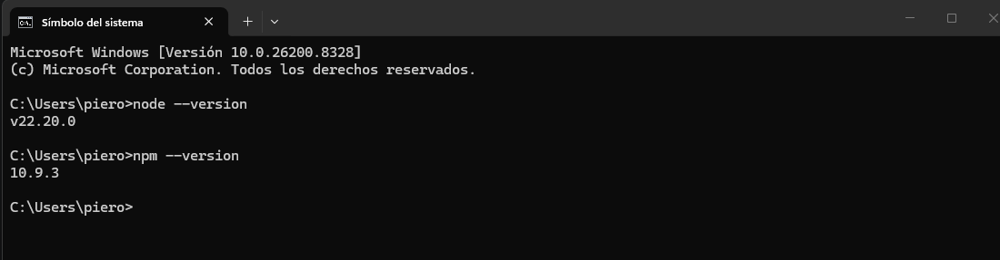

## Evidencia 2 Creacion del proyecto
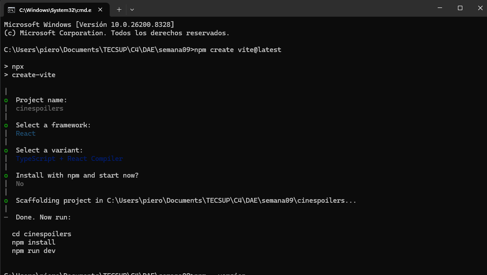

## Evidencia 3 Proyecto Corriendo
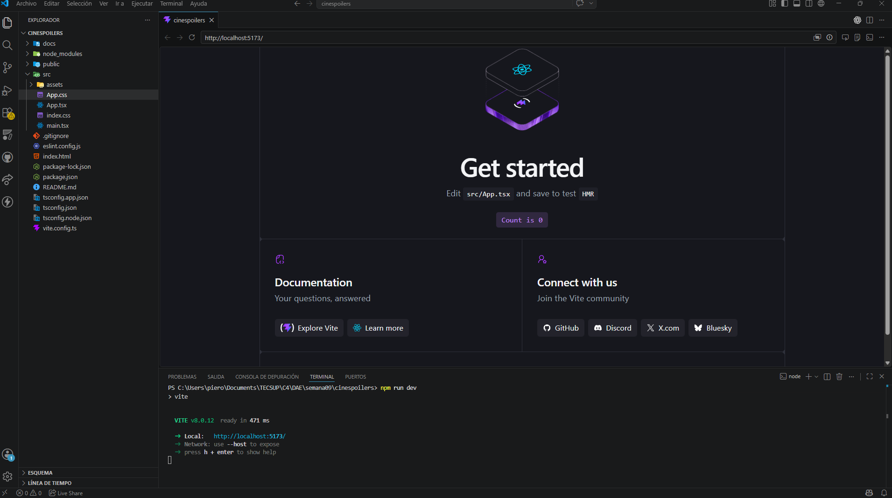

## Evidencia 4 Editar la Bienvenida
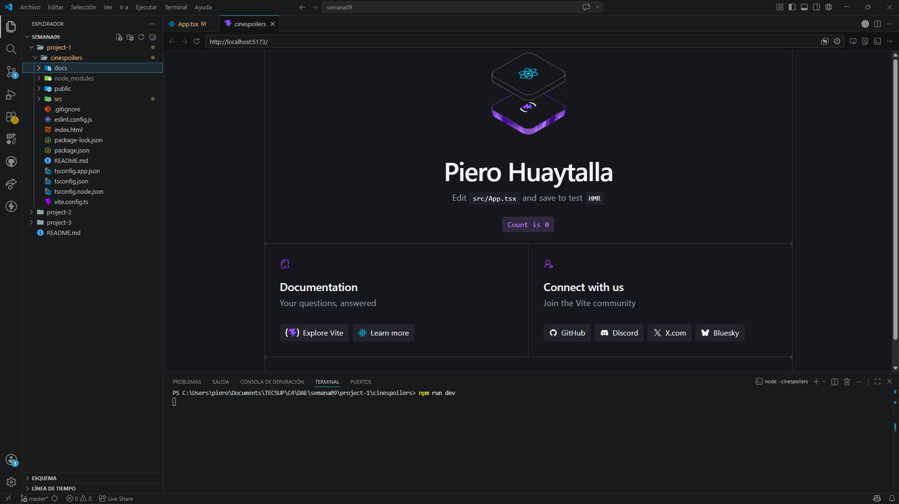

## Evidencia 5 Borrar lo innecesario

## Evidencia 6 Creacion Componente
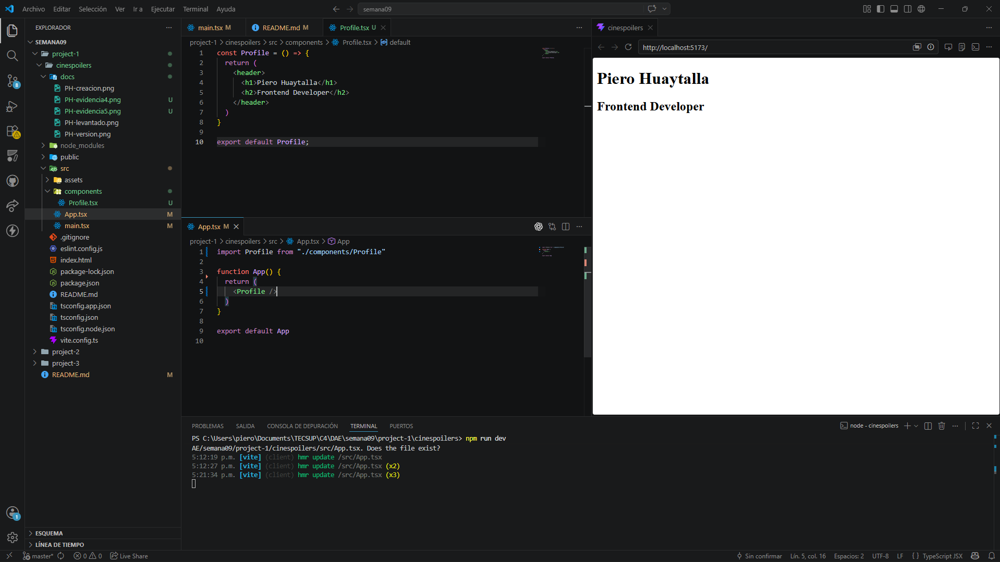

## Autor 
# Andy Campos

## Evidencia 1 Verificaar las versiones

## Evidencia 2 Creacion del proyecto
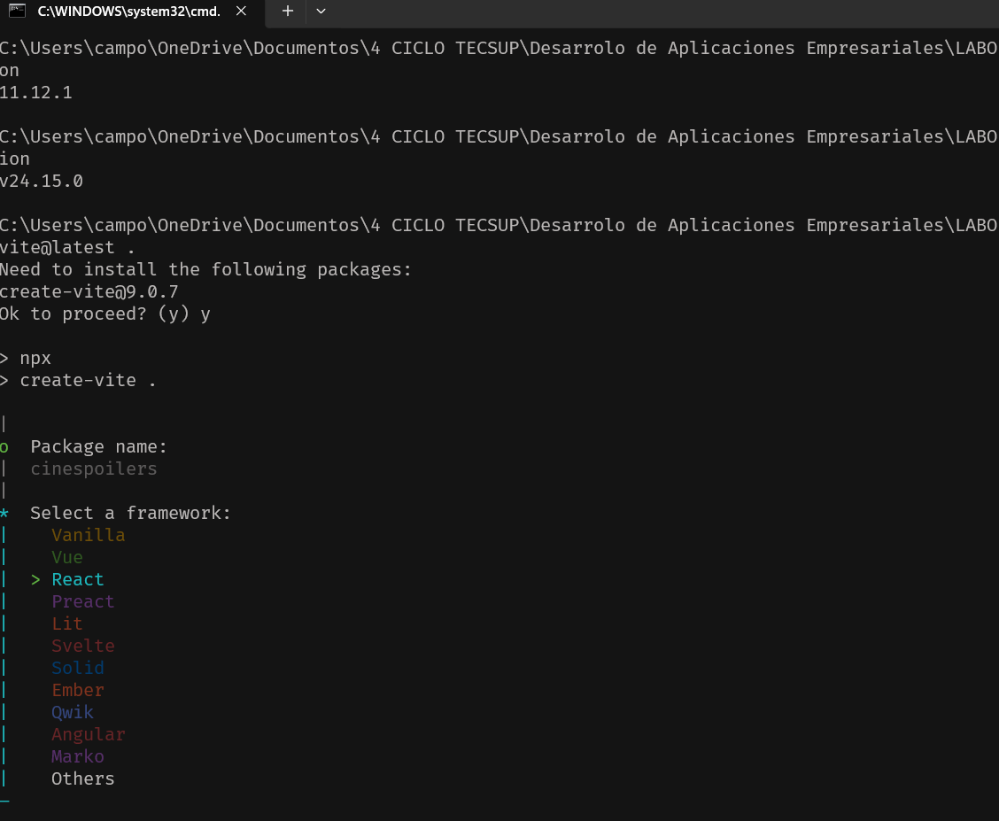

## Evidencia 3 Proyecto Corriendo
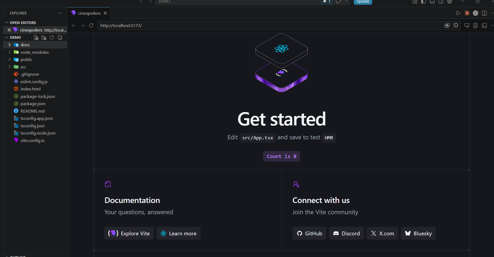

## Evidencia 4 Editar la Bienvenida
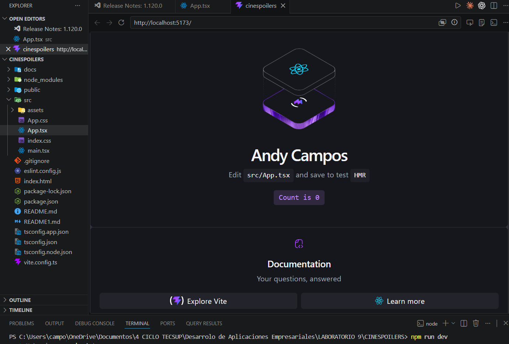

## Evidencia 5 Borrar lo innecesario
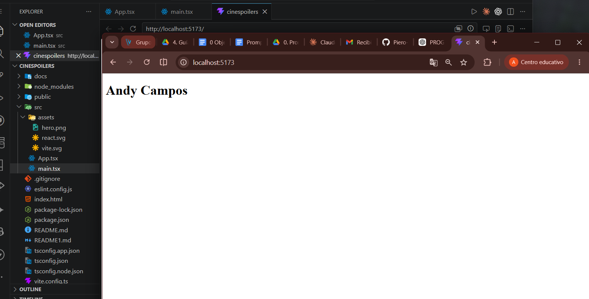

## Evidencia 6 Creacion Componente
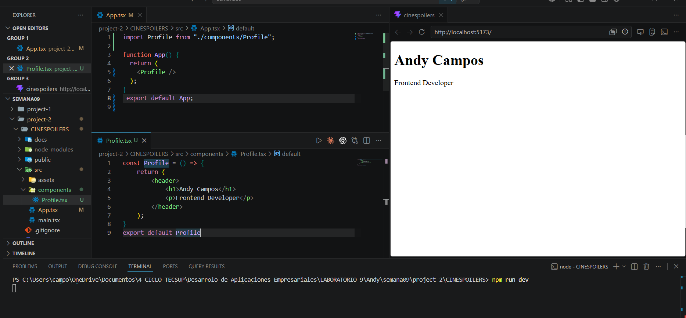

## Evidencia 7 Dos perfiles 
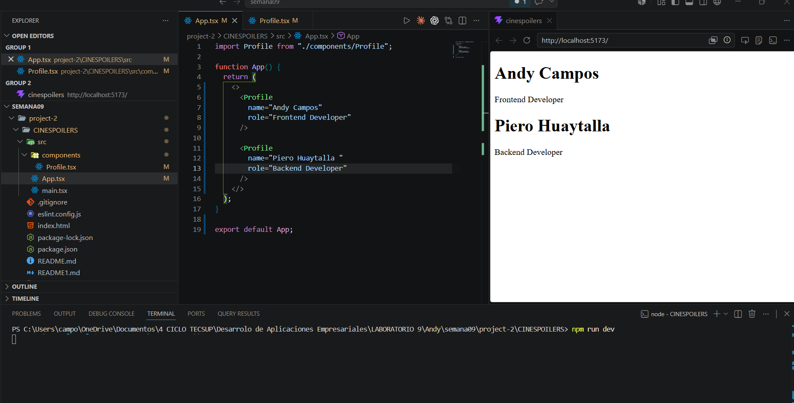
## Autor 
# Pablo Isla

## Evidencia 1 Verificaar las versiones

## Evidencia 2 Creacion del proyecto

## Evidencia 3 Proyecto Corriendo

## Evidencia 4 Editar la Bienvenida

## Evidencia 5 Borrar lo innecesario

## Evidencia 6 Creacion Componente
